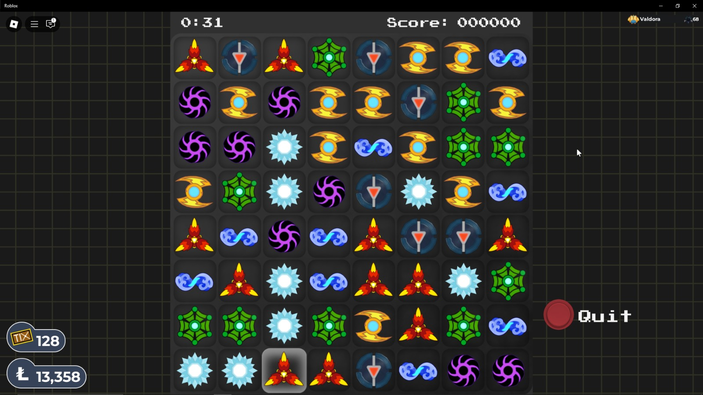
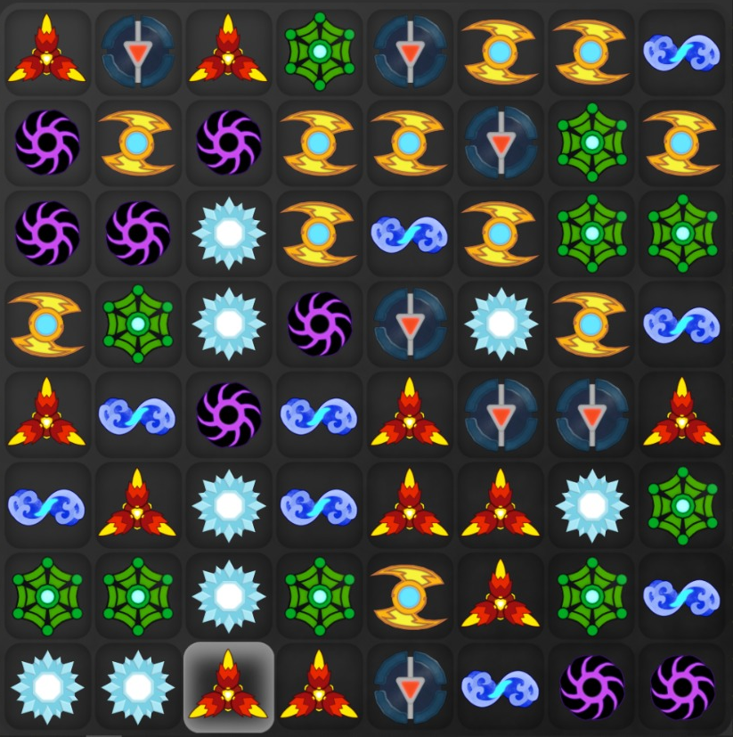

# Candy Crush Game Automation Project

## Project Overview

This repository contains my ongoing work on a Candy Crush game automation and board analysis project.

So far, I have mainly focused on the initial image-processing and board extraction stage, which is the foundation required before implementing move detection and automated gameplay logic.

The current progress is centered around identifying the game grid from screenshots and preparing the board matrix for further analysis.


## Progress So Far

### 1. Screenshot Capture and Board Extraction

The first milestone completed is extracting the game board area from a screenshot.

At this stage, I have:

* captured the Candy Crush game screen
* identified the board region using pixel coordinates
* cropped the exact matrix area from the screenshot
* saved the cropped board image for further processing

This gives me a clean input image that can later be used for candy recognition.


### 2. Manual Coordinate Selection Tool

I have developed a Python script that helps me manually select the game board coordinates.

Using this tool, I can:

* click on the top-left corner of the grid
* click on the bottom-right corner
* verify the selected region visually
* preview the cropped output

This step helps in accurately defining the playable matrix.


### 3. Fixed Grid Crop Script

I have also created a script that performs direct cropping using predefined coordinates.

This script currently:

* reads the game screenshot
* crops the board matrix
* stores the output as an image file

This is useful for repeated testing with the same screen resolution.




## Current Status

At present, the project has successfully reached the image preprocessing stage.

The board extraction workflow is working, and the next phase will be focused on:

* identifying individual candy blocks
* detecting colors / shapes
* converting the board into a matrix format
* implementing move suggestion logic


## Next Planned Work

The next development stages are:

* tile segmentation – split the board into equal cells
* candy recognition – identify each candy type
* pattern detection – detect possible matches
* best move solver – suggest optimal moves
* automation – perform moves automatically


## Current Project Structure

```text
Candy Crush/
│
├── coord.py               # Manual coordinate selection tool
├── screen.py              # Fixed crop script for board extraction
├── game.jpg               # Sample game screenshot
├── cropped_matrix.png     # Output cropped board image
├── README.md              # Project documentation
└── requirements.txt       # Python dependencies (recommended)
```


## How to Run

### 1. Clone the Repository

```bash
git clone https://github.com/yeswanthkutty001-cyber/Candy_Crush_Automation_Project.git
cd Candy-Crush
```

### 2. Install Dependencies

```bash
pip install pillow
```

### 3. Run Coordinate Selection Tool

Use this script to manually select the game board region:

```bash
python coord.py
```

### 4. Run Fixed Crop Script

Use this script to crop the board directly using predefined coordinates:

```bash
python screen.py
```


## Requirements

Before running the scripts, make sure the following are installed:

* Python 3.10+
* Pillow (`PIL`)
* Tkinter (usually included with Python)

Optional (recommended):

```bash
pip install -r requirements.txt
```


## Usage Workflow

A typical workflow for this project is:

1. Capture a screenshot of the Candy Crush game
2. Save it as `game.jpg`
3. Run `coord.py` to identify the board boundaries
4. Use the coordinates in `screen.py`
5. Generate the cropped board image
6. Use the cropped image for future candy recognition logic

This preprocessing pipeline is the current foundation of the project.


## Sample Output

After running the crop script, the expected output is:

```text
cropped_matrix.png
```

This file contains only the Candy Crush board matrix extracted from the original screenshot.




## Roadmap

Upcoming development milestones:

* [x] screenshot capture
* [x] board coordinate selection
* [x] board matrix cropping
* [ ] grid cell segmentation
* [ ] candy classification
* [ ] valid move detection
* [ ] best move prediction
* [ ] auto-play integration


## Contributing

Suggestions, improvements, and automation ideas are always welcome.


## License

This project is currently intended for learning and development purposes.
